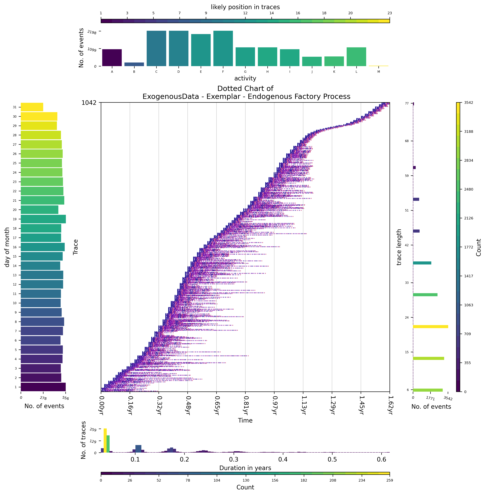

# Exemplar Usage

In this directory we provide exemplar inputs for our Plugin, a description of the process for which the exemplars represent and how to generate alternative instances using the sub directory called "maker".

Exemplar Inputs:
 - An endogenous event log, 
   - endo_log.xes
 - Several exo-panels to instanitanate xPM using our Plugin, and
   - exo_panel_01.xes
   - exo_panel_02.xes
   - exo_panel_03.xes
 - A Petri net with Data control flow model
   - model.pnml

## Process 

The control flow of the process, which we simulate for this exemplar can be seen as a Petri net below:
 

 

The control flow of this process, describes a linear process with a rework loop. 
In this process, there are three decision points, a deicision between D,E,F at p4, a decision to loop back at p6, and a choice of K or L at p8. 
The process itself is not based on any real-world environment or use case but can be used to showcase the tools provided in our plugin. 
The process is about making products for a customer, adjusting the costs of products to maximunise profit by forecasting future costs of materials for a just in time supply chain.
In order to offset future costs, during a process more products may be upsold to the customer to offset price increases but the company only has a fixed amount of production capacity so decisions consider the future capacity of the company.

## Endogenous Data

For each event in the endogenous event log, we have the following mandatory attributes:
 - concept:name = activity label associated with this event
 - lifecycle:transition = state of execution
 - time:timestamp = when an event occured

The following optional attributes could also be attached to events:
 - profit = the amount of profit from invoice
 - cost = the amount of cost associated with the event
 - org:resource = the actor responsible for the event
 - items = the total number of products related to the invoice after the event occured

A visual breakdown of the endogenous log can be seen below (using [vispm](https://github.com/AdamBanham/vispm)):
Event labels have been swapped in the process ! 
Imputation that occured was 'A' -> 'A', 'D' -> 'B', 'B' -> 'C', 'C' -> 'D', 'F' -> 'E', 'G' -> 'F', 'I' -> 'G', 'J' -> 'H', 'H' -> 'I', 'L' -> 'J', 'K' -> 'K', 'M' -> 'L', 'E' -> 'M'.

## Exogenous Data

Three exo-panels have been perpared for this exemplar:
  - exo_panel_01.xes; which outlines the price of copper used to make products,
  - exo_panel_02.xes; which outlines the price of iron used to maked products, and
  - exo_panel_03.xes; which outlines the total free capacity of the production factory over time.

These three exogenous factors generally follow three equations, which given the relative time from 01/01/2122 return a fixed number.
However in our simulation, these numbers are shifted by a random amount (either postive or negative).

To see the general trend for each such equation used in the simulation, check out the following graph plotting them over time (in terms of days, 365 days are highlighted by the grey area).
Red outlines the price of copper,
Green outlines the price of iron,
Blue outlines the capacity of the production factory, and
Orange outlines the profit from a product.
 

## Python make process

In the [make directory](maker/) you can find the following pieces of code that have been used to generate exemplar:
  - make.py; the main python file to generate logs, visualisations and process model
  - controlflow.py; the code used to generate the endogenous event log.
  - utils.py; some helper functions
  - exo_panel_growth.PNG; visualisation of uderlying equations used in the simulation.
  - process.dot, process.png, process.svg; used to generate a diagram of the control-flow. (using Graphviz)
  - Pipfile, Pipfile.lock; pipenv virtual environments that were used to generate log, expecting some version of python 3.9.
    - to generate the same virtual python environment, install [pipenv](https://github.com/pypa/pipenv).
    - then, using a terminal in the maker directory, run the following commands to generate the exemplar logs.
        - pipenv install
        - pipenv shell
        - py make.py

