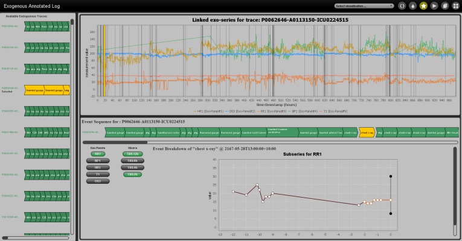

# Exogenous Data ProM Plugin

This package for the ProM framework, implements several features around the xPM framework for process mining with exogenous data. The main feature of this plugin is an interface for viewing the output from several steps of the framework. i.e. viewing an xlog, performing decision mining with exogenous data and generating EESA visualisation (and ranking a collection). While this plugin creates a user-friendly way to interface with xPM, the inputs and outputs (exo-panels and their creation) are still unstable and require a complete formalisation. Furthermore, only a limited set of transformers and slicers are supported. Thus, customised implementations are required for non-trivial slices or transforms. Please get in contact with me if you require assistance with the creation of exo-panels or exo-descriptions, or non-trivial options for creating determinations in a xPM instantiation.

## Features 

The following features have been implemented and can be accessed within ProM via the appropriate plugin. Each the following sections outline the plugin functions and outcomes.

### Exogenous Annotated  Log Explorer

To explore an exogenous annotated log, where you can explore how exogenous data was linked to endogenous traces, view slices attached to events and see an overview of exogenous data intertwined with events, use the following steps to create an xlog and view the outcome.

To create an exogenous annotated log (xlog), use the following plugin called "Exogenous Annotated Log Preparation". Where you supply an event log (XES formatted) and several exo-panels.
Next, an interface for making determinations is presented to user. A user can define generic determinations to apply to all exo-panels or may target transforms or slices for a given exo-panel.

After linking, slicing and transforming is completed, the following plugin can be used to view and explore the xlog, "Exogenous Annotated Log Explorer". This plugin is also available from the dropdown visualiser list when viewing the object within ProM.

By clicking on an endogenous trace on the left panel, an overview of the trace will be generated on the right. A user can then explore exo-panels and slicers to finding associated slices and view them. Using the event sequence on the right, a user can highlight when the trace occurred in the large graph (top-right) and individual breakdowns of each exo-panel and slicers will be filters to clicked event (bottom-right). 

#### Filtering Log Data 
Endogenous traces will be highlighted in left pane, with selected under concept:name.
Clicking on an endogenous event in the right pane will highlighted the event in the overview graph and will filter description graphs below. Click event again to stop filtering and highlighting.
Clicking on the buttons on the left of description graphs will further filter graphs, e.g. only show graphs from a single exo-panel or only show a slices from a set of slicing functions.

### Performing Exogenous Aware Discovery

At this stage, we only have an interface for performing decision mining using the overlapping decision miner by Felix Mannhardt[1]. This interface is currently hard coded to use this miner with specific settings. In the coming developments, a more robust interface will be developed to allow users to select different decision miners and their settings. By using an xlog and a Petri net with data (DPN), the plugin, "Exogenous Aware Discovery", can be used to perform decision mining and then produce EESA visualisations.

After the plugin performs an alignment with the given DPN, the user has the open to select a combination of data attributes (both endogenous or exogenous) to use as the decision miner attempts to find transition guards for decision points. To perform a decision mining run, click the button with the label "Start Investigation".

After an investigation (decision miner called and model updated with transition guards) is completed, the user can view the process model to investigate transition guards that have been associated with a transition by the miner.

 

To explore an outcome in more detail, the user can click the button labelled "Open Enhancement".

### Investigating a process model with exogenous data

After doing so, the user will be able to explore each transition in greater detail and view an EESAs for a transition (Overlapping variants at this stage are hard coded). 

 

To do so, a user needs to click on a transition in the process model visualisation (top) and the transition will be highlighted.

 

Furthermore, for each exo-panel and slicer, a popup can be used to showcase an Individual EESA (median with STD/IQR) or raw slice plot (not recommended when viewing large numbers of slices).

 

### Ranking a collection of EESA visualisation

A user can generate a ranking for overlapping EESA visualisations by clicking the button lablled "search". Then all transitions that have been visited will be pooled and used for the collection of EESAs.
Ranking may take some time depending on the number of EESAs present in the collection.

 

After the ranking is completed, the ranking list (bottom-right) will be populated from rank 1 to rank n, to show where overlapping EESA were found. Then rank n+1 (bottom of the list with common= -1) show where non-overlapping EESAs exist.
Clicking on a ranking item in the will highlight the transition it came from in the process model (top) and the EESA in question will be shown (bottom-left).

 

## Issues

To request assistance in using this plugin or for clarification on a feature, create an issue with the label "help-requested".

## Feature Requests

To request new features to be implemented or where hard coding exists and should be removed, create an issue with the label "feature-request".

## Contact

To get in contact, see https://www.adambanham.io/#/contact for my current email addresses and socials.

# References

[1] F. Mannhardt, M. de Leoni, H. A. Reijers, and W. M. P. van der Aalst, “Decision Mining Revisited - Discovering Overlapping Rules,” in Advanced Information Systems Engineering, Cham, 2016, pp. 377–392.
 
or 
 
F. Mannhardt, M. De Leoni, and H. A. Reijers, “The multi-perspective process explorer,” in CEUR Workshop Proceedings, Innsbruck, Austria, Sep. 2015, vol. 1418, pp. 130–134.
